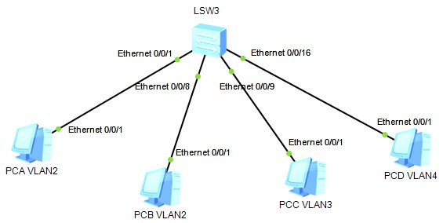

# VLAN 虚拟局域网
1. vlan基本配置

   1.1. 命令行列表
   
   操作|命令
   ---|---
   创建vlan|vlan *vlan-id* [alias vlan-alias]
   删除vlan|undo vlan *vlan-id* [\|all]
   vlan视图下配置一个或者一组端口属于某个vlan|port interface-type {interface-num [to interface-num]}&<1-10>
   接口视图下配置该端口属于某个vlan|port access vlan *vlan-id*
   指定端口类型：trunk,access,hybrid|port *link-type* {trunk/access/hybrid}
   取消商品类型的设置|undo port *link-type* {trunk/access/hybrid}
   设置Trunk端口可以通过的VLAN|[undo] port trunk permit vlan {{*vlan-id* [to *vlan-id*]} & <1-10> \| all}
   显示VLAN的信息|display vlan *vlan-id* [/all]
   进入VLAN三层虚接口视图|interface vlan-interface *vlan-id*
   配置静态路由|ip route-static <ip_address> [\<mesk\> \| \<masklen\>] \<interface_name\> \| \<gateway_address\> [preference <preference_value>] [reject \|backhole]
   显示路由信息|display ip routing-table

   1.2. 组网及业务描述
      
      在同一交换机内同一vlan的PC可以互通，不同vlan的PC不可互通。

## 2. Trunk基本配置
## 3. vlan间的三层互通