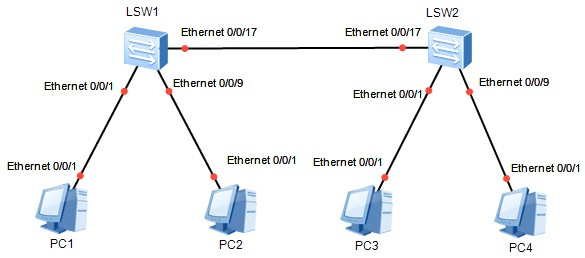

# VLAN 虚拟局域网


## 1. 命令行列表
   
   操作|命令
   ---|---
   创建vlan|vlan *vlan-id* [alias vlan-alias]
   删除vlan|undo vlan *vlan-id* [\|all]
   vlan视图下配置一个或者一组端口属于某个vlan|port interface-type {interface-num [to interface-num]}&<1-10>
   接口视图下配置该端口属于某个vlan|port access vlan *vlan-id*
   指定端口类型：trunk,access,hybrid|port *link-type* {trunk/access/hybrid}
   取消商品类型的设置|undo port *link-type* {trunk/access/hybrid}
   设置Trunk端口可以通过的VLAN|[undo] port trunk permit vlan {{*vlan-id* [to *vlan-id*]} & <1-10> \| all}
   显示VLAN的信息|display vlan *vlan-id* [/all]
   进入VLAN三层虚接口视图|interface vlan-interface *vlan-id*
   配置静态路由|ip route-static <ip_address> [\<mesk\> \| \<masklen\>] \<interface_name\> \| \<gateway_address\> [preference <preference_value>] [reject \|backhole]
   显示路由信息|display ip routing-table

## 2. vlan基本配置

   ### 2.1. 组网及业务描述

   
   
   在同一交换机内同一vlan的PC可以互通，不同vlan的PC不可互通。

   ### 2.2. 配置说明

Device|IP|Subnet Mask|Gateway
:-:|:-:|:-:|:-:
PCA|192.168.2.1|255.255.255.0|192.168.2.254
PCB|192.168.2.2|255.255.255.0|192.168.2.254
PCC|192.168.3.1|255.255.255.0|192.168.3.254
PCD|192.168.3.2|255.255.255.0|192.168.3.254
VLAN2|192.168.2.254|255.255.255.0|
VLAN3|192.168.3.254|255.255.255.0|

   ### 2.3. 实例代码

```
<Huawei>system-view 
Enter system view, return user view with Ctrl+Z.
[Huawei]vlan 2
[Huawei-vlan2]quit
[Huawei]vlan 3
[Huawei-vlan3]quit
[Huawei]port-group group-member Ethernet 0/0/1 Ethernet 0/0/8
[Huawei-port-group]port link-type access
[Huawei-Ethernet0/0/1]port link-type access
[Huawei-Ethernet0/0/8]port link-type access
[Huawei-port-group]port default vlan 2
[Huawei-Ethernet0/0/1]port default vlan 2
[Huawei-Ethernet0/0/8]port default vlan 2
[Huawei-port-group]quit
[Huawei]port-group group-member eth0/0/9 eth0/0/16
[Huawei-port-group]port link-type access
[Huawei-Ethernet0/0/9]port link-type access
[Huawei-Ethernet0/0/16]port link-type access
[Huawei]vlan 3
[Huawei-vlan3]port Ethernet 0/0/9 0/0/16
[Huawei-vlan3]quit
[Huawei]display vlan
The total number of vlans is : 3
--------------------------------------------------------------------------------
U: Up;         D: Down;         TG: Tagged;         UT: Untagged;
MP: Vlan-mapping;               ST: Vlan-stacking;
#: ProtocolTransparent-vlan;    *: Management-vlan;
--------------------------------------------------------------------------------

VID  Type    Ports                                                          
--------------------------------------------------------------------------------
1    common  UT:Eth0/0/2(D)     Eth0/0/3(D)     Eth0/0/4(D)     Eth0/0/5(D)     
                Eth0/0/6(D)     Eth0/0/7(D)     Eth0/0/10(D)    Eth0/0/11(D)    
                Eth0/0/12(D)    Eth0/0/13(D)    Eth0/0/14(D)    Eth0/0/15(D)    
                Eth0/0/17(D)    Eth0/0/18(D)    Eth0/0/19(D)    Eth0/0/20(D)    
                Eth0/0/21(D)    Eth0/0/22(D)    GE0/0/1(D)      GE0/0/2(D)      
2    common  UT:Eth0/0/1(U)     Eth0/0/8(U)                                     

3    common  UT:Eth0/0/9(U)     Eth0/0/16(U)                                    

VID  Status  Property      MAC-LRN Statistics Description      
--------------------------------------------------------------------------------
1    enable  default       enable  disable    VLAN 0001                         
2    enable  default       enable  disable    VLAN 0002                         
3    enable  default       enable  disable    VLAN 0003                         
[Huawei]interface vlanif 2
[Huawei-Vlanif2]ip address 192.168.2.254 24
[Huawei-Vlanif2]quit
[Huawei]interface Vlanif 3
[Huawei-Vlanif3]ip address 192.168.3.254 24
[Huawei-Vlanif3]quit
[Huawei]
```

## 3. Trunk基本配置

   ### 3.1. 组网及业务描述


   ### 3.2. 配置说明

   Devices|IP|Subnet Mask|VLAN|连接接口
   :-:|:-:|:-:|:-:|:-:
   PC1|10.1.1.2|24|VLAN2|S1 e0/0/1
   PC2|10.1.2.2|24|VLAN3|S1 e0/0/9
   PC3|10.1.1.3|24|VLAN2|S2 e0/0/1
   PC4|10.1.2.3|24|VLAN3|S2 e0/0/9
   S1||||S1 e0/0/17 <-> S2 e0/0/17
   S2||||S2 e0/0/17 <-> S1 e0/0/17

   ### 3.3. 效果
   
   同一VLAN内部的PC可以互相访问，PC1与PC3可以互相ping通。

   不同VLAN间的PC不能互相访问，PC1与PC2不能互相ping通。

   ### 3.4. 实例代码

```
<Huawei>system-view 
Enter system view, return user view with Ctrl+Z.
[Huawei]sysname s1
[s1]
[s1]vlan 2
[s1-vlan2]vlan 3
[s1-vlan3]quit
[s1]port-group group-member Ethernet 0/0/1 to Ethernet 0/0/8
[s1-port-group]port link-type access 
[s1-Ethernet0/0/1]port link-type access 
[s1-Ethernet0/0/2]port link-type access 
[s1-Ethernet0/0/3]port link-type access 
[s1-Ethernet0/0/4]port link-type access 
[s1-Ethernet0/0/5]port link-type access 
[s1-Ethernet0/0/6]port link-type access 
[s1-Ethernet0/0/7]port link-type access 
[s1-Ethernet0/0/8]port link-type access 
[s1-port-group]quit
[s1]
[s1]port-group group-member Ethernet 0/0/1 to Ethernet 0/0/8
[s1-port-group]port default vlan 2
[s1-Ethernet0/0/1]port default vlan 2
[s1-Ethernet0/0/2]port default vlan 2
[s1-Ethernet0/0/3]port default vlan 2
[s1-Ethernet0/0/4]port default vlan 2
[s1-Ethernet0/0/5]port default vlan 2
[s1-Ethernet0/0/6]port default vlan 2
[s1-Ethernet0/0/7]port default vlan 2
[s1-Ethernet0/0/8]port default vlan 2
[s1-port-group]quit
[s1]
[s1]port-group group-member Ethernet 0/0/9 to Ethernet 0/0/16
[s1-port-group]port link-type access
[s1-Ethernet0/0/9]port link-type access
[s1-Ethernet0/0/10]port link-type access
[s1-Ethernet0/0/11]port link-type access
[s1-Ethernet0/0/12]port link-type access
[s1-Ethernet0/0/13]port link-type access
[s1-Ethernet0/0/14]port link-type access
[s1-Ethernet0/0/15]port link-type access
[s1-Ethernet0/0/16]port link-type access
[s1-port-group]quit
[s1]vlan 3
[s1-vlan3]port Ethernet 0/0/9 to 0/0/16
[s1-vlan3]quit
[s1]interface Ethernet 0/0/17
[s1-Ethernet0/0/17]port link-type trunk 
[s1-Ethernet0/0/17]port trunk allow-pass vlan all
[s1-Ethernet0/0/17]
[s1-Ethernet0/0/17]return 
<s1>save 
The current configuration will be written to the device.
Are you sure to continue?[Y/N]y
Info: Please input the file name ( *.cfg, *.zip ) [vrpcfg.zip]:
Nov 29 2018 13:44:06-08:00 s2 %%01CFM/4/SAVE(l)[0]:The user chose Y when decidin
g whether to save the configuration to the device.
Now saving the current configuration to the slot 0.
Save the configuration successfully.
<s1>
```

## 4. vlan间的三层互通