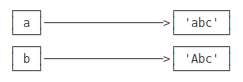

# dict与set

## dict
`dict`全称dictionary，其它语言又称`map`，使用键-值（key-value）存储。查找速度快。


```python
d = {'张三':95, '李四':83, '王五': 66}

print(d['李四'])
```

    83


数据存入`dict`

直接对`key`赋值

一个`dict`内相同的`key`只能有一个。如果对同一个`key`多次赋值，后赋值的会覆盖前面的


```python
d['马六'] = 54
print(d)

d['马六'] = 37
d['马六'] = 60
print(d)
```

    {'张三': 95, '李四': 83, '王五': 66, '马六': 54}
    {'张三': 95, '李四': 83, '王五': 66, '马六': 60}


取值时，如果`key`不存在，会报错


```python
print(d['陈七'])
```


    ---------------------------------------------------------------------------

    KeyError                                  Traceback (most recent call last)

    <ipython-input-27-cf71239afae3> in <module>
    ----> 1 print(d['陈七'])
    

    KeyError: '陈七'


避免出错的方法：

* 通过`in`判断`key`是否存在
* 通过`dict`提供的`get()`方法，如果`key`不存在，返回`None`，或自己指定的`value`

注意：返回`None`的时候Python的交互环境不显示结果。


```python
print('陈七' in d)

print(d.get('陈七'))    #注意：返回None的时候Python的交互环境不显示结果。

print(d.get('陈七', -1))
```

删除一个`key`

使用`pop(key)`的方法，对应的`value`也会从`dict`删除


```python
d.pop('王五')
print(d)
```

请务必注意，dict内部存放的顺序和key放入的顺序是没有关系的。

和list比较，dict有以下几个特点：

* 查找和插入的速度极快，不会随着key的增加而变慢；
* 需要占用大量的内存，内存浪费多。

而list相反：

* 查找和插入的时间随着元素的增加而增加；
* 占用空间小，浪费内存很少。

所以，dict是用空间来换取时间的一种方法。

需要牢记的就是`dict`的`key`必须是不可变对象。这是因为`dict`根据`key`来计算`value`的存储位置，如果每次计算相同的`key`得出的结果不同，那`dict`内部就完全混乱了。这个通过`key`计算位置的算法称为哈希算法（Hash）。

要保证hash的正确性，作为`key`的对象就不能变。在Python中，字符串、整数等都是不可变的，因此，可以放心地作为`key`。而`list`是可变的，就不能作为`key`

## set

与`dict`类似，也是`key`的集合，但不存储`vlaue`，`key`也是不能重复

创建一个`set`，需要提供一个`list`作为输入集合

注意，传入的参数[1, 2, 3]是一个`list`，而显示的{1, 2, 3}只是告诉你这个`set`内部有1，2，3这3个元素，显示的顺序也不表示`set`是有序的。

重复的元素会被自动过滤。


```python
s = set([1, 2, 3])
print(s)

s = set([1, 1, 2, 2, 3, 3])    #重复的元素会被自动过滤
print(s)
```

`add(key)`：添加元素，可重复添加，但没有效果

`remove(key)`：删除元素

`&`：交集

`|`：并集


```python
s.add(4)
print(s)
s.add(4)
print(s)

s.remove(3)
print(s)

s1 = set([1, 2, 3])
s2 = set([2, 3, 4])
print('交集&：%s' %(s1 & s2))
print('并集|：%s' %(s1 | s2))
```

`set`和`dict`的唯一区别仅在于没有存储对应的`value`，但是，`set`的原理和`dict`一样，所以，同样不可以放入可变对象，因为无法判断两个可变对象是否相等，也就无法保证`set`内部“不会有重复元素”

## 不可变对象

`str`是不可变对象，`list`是可变对象

对于可变对象，如`list`，对`list`操作会改变`list`内部的内容


```python
l = ['c', 'a', 'b']
l.sort()
print(l)

a = 'abc'
print(a.replace('a', 'A'))
print(a)

b = a.replace('a', 'A')
print(b)
```

`'a'`是变量,`'abc'`是字符串对象。即`‘a'`这个变量指向`'abc'`这个字符串对象。

`a.replace('a', 'A')`没有改变字符串`'abc'`,而是创建了一个新的字符串`'Abc'`



所以，对于不变对象来说，调用对象自身的任意方法，也不会改变该对象自身的内容。相反，这些方法会创建新的对象并返回，这样，就保证了不可变对象本身永远是不可变的。

使用key-value存储结构的`dict`在Python中非常有用，选择不可变对象作为`key`很重要，最常用的`key`是字符串。

`tuple`虽然是不变对象，但试试把(1, 2, 3)和(1, [2, 3])放入`dict`或`set`中，并解释结果。
